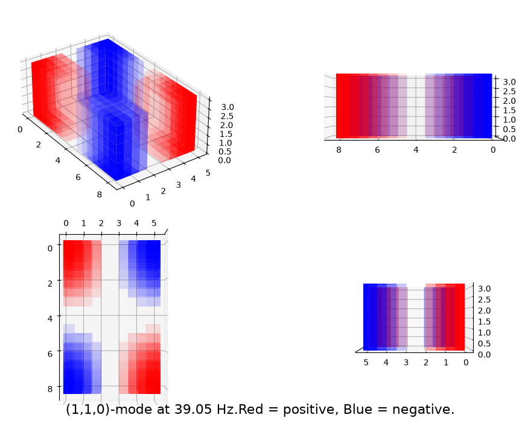
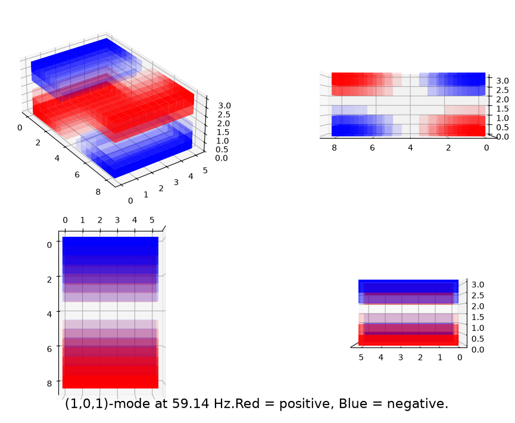
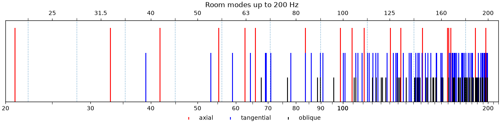

# Room Mode Calculator and Visualizer for Shoebox Rooms 

## Overview
Given the length, width and height of a rectangular room, the project calculates its theoretical eigenfrequencies and room modes. The results are exported as tables, and visualized using a resonance stemplot 3d pressure maps. The implementation is minimal, requiring only NumPy and Matplotlib as external dependencies.

## A little bit of theory
Say you're 23, live in Berlin, and you're gussing up your living room for the big party tonight. You bring out four hand-me-down columns and a subwoofer out of the basement. You put on some bass-heavy techno, say [Welcome Too Hell](https://www.youtube.com/watch?v=Ar64Mr6ZVCs) by Pandemonium, and as you start to run to the door to tell you roommate about the gnarly setup, suddenly, mid-stride, the bass is gone! How come? Well, without some serious acoustic treatment, certain low frequencies will have "spotty reception," and the culprits are so-called **room modes**.

For example: you have a mode at 50 Hz. The sound waves will tend to reflect repeatedly between parallel walls, constructively and destructively interfering and resulting in **standing waves**. These look like repeating regions of very high positive or negative acoustic pressure. In between the peaks and valley, there are regions of constant zero acoustic pressure. As a result, even taking one step may kill the frequencies close to 50 Hz entirely, and thus the party. In a rectangular room, these standing waves form potentially in every direction, meaning even sitting down could mean the bass disappears. Counting the number of "dead spots" from wall to wall in the x-direction gives you $n_x$, similarly, you get $n_y$ and $n_z$. We then say there is a $(n_x, n_y, n_z)$-mode at 50 Hz. A (1,1,0)-mode would mean along both sets of side walls you encounter a region of zero acoustic pressure, the sound is loudest in the corners, and moving your head vertically doesn't sound different.

If you know $(n_x, n_y, n_z)$ and the room's dimensions $L_x,L_y$ and $L_z$ (and the speed of sound $c$ in m/s), you can calculate the frequency associated to it:
```math
f = \frac{c}{2}\sqrt{\Big(\frac{n_x}{L_x}\Big)^2+\Big(\frac{n_y}{L_y}\Big)^2+\Big(\frac{n_z}{L_z}\Big)^2}
```
We call $f$ an **eigenfrequency**. For example: a room with dimensions 8.2 x 5.2 x 3.1 meters has a (1,1,0)-mode with eigenfrequency of about 39 Hz. Its sound pressure distribution would look like this

<p align="center">
    
</p>

*Note: the dead cross-shaped region is exaggerated to distinguish the pressure "clouds". If you'd like to make these smaller/larger you can adjust the setting in the **Usage** section.*

Another example:

<p align="center">
    
</p>

The formula used to generate the 3d-plots is
```math
\underline{p}_{n_xn_yn_z}(x,y,z) = \underline{\hat{p}}\cos{\Big(\frac{n_x\pi}{L_x}x\Big)}\cos{\Big(\frac{n_y\pi}{L_y}y\Big)} \cos{\Big(\frac{n_z\pi}{L_z}z\Big)}
```
where $x,y,z$ represent the coordinate position in the room and $\underline{\hat{p}}$ the complex amplitude (For illustration purposes, the amplitude is ignored. Roughly speaking, a higher absolute value would mean a louder tone.)

The above examples are just two of many modes found in your hypothetical living room. Along with the above plots, the code also generates a stem plot:

<p align="center">
    
</p>

In the plot, the type of mode is distinguished. **Axial** modes involve standing waves along only one direction, **tangential** involve 2, and **oblique** feature all 3. 
## Installation

Clone the repository and navigate into the project directory:

```bash
git clone https://github.com/SwimmyDan/room_modes.git
cd room_modes
```

Install the required Python packages:

```bash
pip install -r requirements.txt
```

The project requires **Python 3.10 or newer**.

## Usage

Run the main script from the project directory:

```bash
python main.py
```

The room dimensions and calculation settings can be adjusted directly in `main.py`:

```python
# Room dimensions in meters
Lx = 8.2
Ly = 5.2
Lz = 3.1

# Calculation settings
max_mode = 10
max_f = 100
c = 343
```

The visualization settings can also be adjusted:

```python
# Visualization settings
modes_plotted = 8
step_size = 0.5
pressure_factor = 2
```

After execution, the program calculates the room modes, exports the results, and generates the corresponding visualizations. Output files are saved in the `outputs/` directory.


### Room dimensions
|**Parameter**| **Description**    |**Unit** |
| ----------- | ----------- |--------| 
| `Lx`| Length |m |
|`Ly`| Width |m |
| `Lz`| Height |m |


### Calculation settings
|**Parameter**| **Description**    |**Unit** |
| ----------- | ----------- |--------| 
| `max_mode` | maximum mode index calculated for each mode index $n_x,n_y,n_z$| --|
| `max_f`| maximum frequency calculated| Hz|
| `c`| speed of sound in air | m/s | 

It is recommended to set `max_mode` high enough (10 or more) for typical listening/living rooms. Setting `max_f=-1` disables the frequency cut-off. Otherwise, `max_f` will remove higher eigenfrequencies from the table and stem plot. The speed of sound is usually 343 m/s at 20 °C.  


### Visualization settings
|**Parameter**| **Description**    |**Unit** |
| ----------- | ----------- |--------|
| `modes_plotted`| Number of lowest room modes for which 3d-plots are generated| --|
|`step_size`| spatial resolution in 3d-plots| m |
|`pressure_factor`| exaggerates pressure clouds. Higher = more extreme. | --|

As creating 3d-plots using `ax.voxels` with matplotlib can take some time, you can adjust for how many modes a plot should be created, starting from the lowest, using `modes_plotted`. Setting too high a  `step_size` will result in a warning, and setting it very low will significantly increase computation time. `step_size =0.5` is a reasonable compromise. Setting `pressure_factor=1` follows the pressure equation exactly, however I find that the clouds look "nicer" with it set to 2.

## Project structure

```text
room_modes/
├── main.py              # Main program and configuration
├── modes.py             # Room mode and eigenfrequency calculations
├── visualization.py     # Resonance and pressure visualizations
├── export.py            # Export calculated modes
├── requirements.txt     # Python dependencies
├── examples/            # Example visualizations
└── outputs/             # Generated results
```

## Limitations

The model assumes an ideal rectangular room with rigid, perfectly reflecting boundaries. It does not account for factors such as wall absorption, furniture, and irregular room geometry. My implementation prioritizes simplicity and readability. Faster code can be accomplished using for example [Numba](https://caopensource.org/Tutorials/posts/acoustics-modes-of-a-rectangular-room/#sec-calc-modes). To throw an unforgetable banger of a party, you probably don't need to figure out the layouts of sub-bass modes in your living room... but your acoustic-planner friends will thank you ;)

## References 

Everest, F. Alton. *The Master Handbook of Acoustics*, 4th ed.,
McGraw-Hill, 2001, p. 326.
